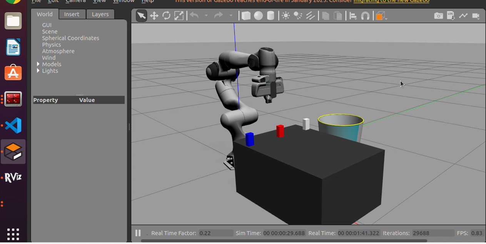

# Franka Emika Panda – Vision-Based Pick & Place


A complete **ROS Noetic + Python** project for detecting colored objects using an **Intel RealSense D435i camera** and performing **autonomous pick-and-place** operations using the **Franka Emika Panda** robotic arm 7 DOF. This system integrates MoveIt for motion planning, collision avoidance, and the Gazebo Grasp Fix plugin for stable simulation physics.

---

## 📺 Demo Video
[▶️ Click here to watch the Final Demo](./Final%20Demo.mp4)
## 📸 Final Demo Photo


---

## 📝 Overview

This project implements a **vision-guided pick-and-place pipeline** completely in Python.

The system performs the following tasks automatically:
1.  **Detection:** Detects a colored object (stone) using RGB image processing (OpenCV).
2.  **Localization:** Computes 3D coordinates from aligned depth data.
3.  **Transformation:** Converts Camera Coordinates → Robot Base Frame using TF.
4.  **Physics:** Utilizes the **Gazebo Grasp Fix Plugin** to prevent object slippage ("soap bar effect") in simulation.
5.  **Planning:** Generates collision-free motion plans using **MoveIt**.
6.  **Execution:** Picks the object using the Panda gripper and places it into a designated basket.

---

## 🧱 System Architecture

```text
Intel RealSense D435i  →  Vision Node (stone_detector.py)
              │                 ↓
              RGB + Depth      3D Object Pose (/stone_position)
              │                 ↓
              TF Transforms  →  Pick & Place Node (stone_picker.py)
                       ↓
                    MoveIt Motion Planning
                       ↓
                    Panda Arm + Gripper

   ```

   ---


## 🛠️ Prerequisites

- OS: Ubuntu 20.04 LTS
- ROS: Noetic
- Simulator: Gazebo 11
- Python: 3.8+

## 📦 Installation

Below are the installation steps grouped into clear subsections. Run the shell commands in an Ubuntu 20.04 terminal (bash). Each command block contains the commands to copy/paste.


### 🔧 1) Install ROS Noetic
Follow the official ROS instructions, or run the commands below to add the ROS repo and install the desktop package:

```bash
sudo sh -c 'echo "deb http://packages.ros.org/ros/ubuntu $(lsb_release -sc) main" > /etc/apt/sources.list.d/ros-latest.list'
sudo apt install curl -y
curl -s https://raw.githubusercontent.com/ros/rosdistro/master/ros.asc | sudo apt-key add -
sudo apt update
sudo apt install ros-noetic-desktop-full -y

sudo apt install python3-rosdep python3-rosinstall python3-rosinstall-generator python3-wstool build-essential -y
sudo rosdep init || true
rosdep update

echo "source /opt/ros/noetic/setup.bash" >> ~/.bashrc
source ~/.bashrc
```

Notes:
- If `rosdep init` fails because it was already initialized, that is safe to ignore.

### 🤖 2) Install franka_ros (Franka ROS packages)
Reference: https://frankarobotics.github.io/docs/

```bash
sudo apt install ros-noetic-libfranka ros-noetic-franka-ros -y
mkdir -p ~/franka/src
cd ~/franka
source /opt/ros/noetic/setup.bash
catkin_init_workspace src
git clone --recursive https://github.com/frankarobotics/franka_ros src/franka_ros
cd src/franka_ros && git checkout 0.9.0 || true
cd ~/franka
rosdep install --from-paths src --ignore-src --rosdistro noetic -y --skip-keys libfranka
catkin_make -DCMAKE_BUILD_TYPE=Release -DFranka_DIR:PATH=/path/to/libfranka/build
source devel/setup.bash
```

Replace `/path/to/libfranka/build` with the actual path where you built `libfranka` (see step 3).

### 🦾 3) Install libfranka (Franka C++ API)
Run these commands inside a workspace folder (e.g. `~/franka`):

```bash
sudo apt-get update
mkdir -p ~/franka && cd ~/franka
sudo apt-get install -y build-essential cmake git libpoco-dev libeigen3-dev libfmt-dev

sudo apt-get install -y lsb-release curl
sudo mkdir -p /etc/apt/keyrings
curl -fsSL http://robotpkg.openrobots.org/packages/debian/robotpkg.asc | sudo tee /etc/apt/keyrings/robotpkg.asc
echo "deb [arch=amd64 signed-by=/etc/apt/keyrings/robotpkg.asc] http://robotpkg.openrobots.org/packages/debian/pub $(lsb_release -cs) robotpkg" | sudo tee /etc/apt/sources.list.d/robotpkg.list

sudo apt-get update
sudo apt-get install -y robotpkg-pinocchio
sudo apt-get remove --purge "*libfranka*" || true

git clone --recurse-submodules https://github.com/frankarobotics/libfranka.git
cd libfranka
git checkout 0.9.0
git submodule update --init --recursive
mkdir build && cd build
cmake -DCMAKE_BUILD_TYPE=Release -DBUILD_TESTS=OFF ..
make -j$(nproc)
cpack -G DEB
sudo dpkg -i libfranka*.deb
```

### 🟣 4) Install MoveIt (MoveIt 1 for ROS Noetic)
Follow the MoveIt getting started guide or run the commands below to create a workspace and build MoveIt components:

```bash
mkdir -p ~/ws_moveit/src
cd ~/ws_moveit/src
wstool init .
wstool merge -t . https://raw.githubusercontent.com/moveit/moveit/master/moveit.rosinstall
wstool remove moveit_tutorials || true
wstool update -t .

git clone https://github.com/moveit/moveit_tutorials.git -b master
git clone https://github.com/moveit/panda_moveit_config.git -b noetic-devel

cd ~/ws_moveit
rosdep install -y --from-paths src --ignore-src --rosdistro noetic
sudo sh -c 'echo "deb http://packages.ros.org/ros-testing/ubuntu $(lsb_release -sc) main" > /etc/apt/sources.list.d/ros-latest.list'
sudo apt update

catkin config --extend /opt/ros/${ROS_DISTRO} --cmake-args -DCMAKE_BUILD_TYPE=Release
catkin build
source ~/ws_moveit/devel/setup.bash
echo 'source ~/ws_moveit/devel/setup.bash' >> ~/.bashrc
```

### 🎥 5) Install RealSense SDK + ROS Wrapper
Official repo: https://github.com/realsenseai/realsense-ros

```bash
sudo apt install ros-noetic-librealsense2* -y
sudo apt install ros-noetic-realsense2-camera -y
# Test the camera (replace with your launch file or parameters):
roslaunch realsense2_camera rs_camera.launch
```

### 🧲 6) Install Gazebo Grasp Fix (simulation plugin)
This plugin helps prevent the object from slipping during simulation.

```bash
cd ~/franka_ws/src
git clone https://github.com/JenniferBuehler/gazebo-pkgs.git
git clone https://github.com/JenniferBuehler/general-message-pkgs.git
```

### 🧰 7) Install Python dependencies
Install the Python packages used by the perception and utilities:

```bash
pip3 install --user opencv-python numpy pyrealsense2 transforms3d
```

---

## 🚀 Usage

#### 1. Launch Franka + MoveIt + RealSense Camera
Loads the Franka Panda, RealSense camera, table, stone, and bin into Gazebo.

```bash
roslaunch panda_moveit_config demo_gazebo.launch
```

#### 2. Run the Perception Node Detects the stone and publishes /stone_position.

```bash
rosrun stone_detector stone_detector.py
```

#### 3. Run the Pick & Place Node Controls the robot to pick the stone and place it in the bin.

```bash
rosrun stone_detector stone_picker.py
```

---

## ⚠️ Safety Notes (Real Robot)

This code is currently configured for Simulation. If porting to a real Franka Emika Panda:

- Emergency Stop: Always keep one hand near the external activation device (E-Stop).

- Velocity: Start with low velocity scaling factors (< 0.1) in the MoveIt script.

- Transforms: Validate your camera-to-robot static transform (TF) with a physical calibration target before execution.

- Workspace: Ensure the basket and table locations match the real world coordinates exactly.

---


## 📚 References:

- Franka Emika Documentation
https://frankarobotics.github.io/docs/

- MoveIt Tutorials
https://moveit.github.io/moveit_tutorials/doc/getting_started/getting_started.html

- RealSense ROS Wrapper
https://github.com/realsenseai/realsense-ros

- Gazebo Grasp Fix Plugin
https://github.com/JenniferBuehler/gazebo-pkgs

---

## 🤝 Credits
Developed by **Abdalah Saad** 
Licensed under MIT License – feel free to use, modify, and distribute
